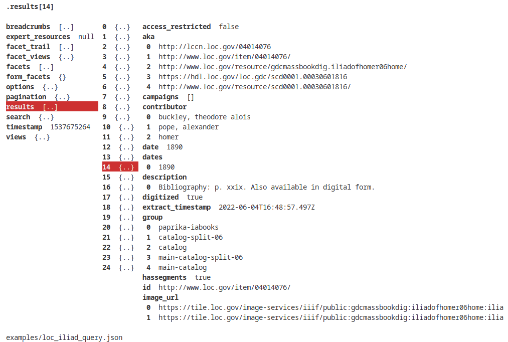

# jinsp

jinsp is a Linux terminal-based interface (TUI) for browsing and inspecting JSON data.
It allows navigation through a JSON file's tree structure using [Miller columns](https://en.wikipedia.org/wiki/Miller_columns) (in a manner similar, for instance, to that of the [ranger file manager](https://github.com/ranger/ranger)).

## Build

Run `make` in the root directory.

## Usage

Launch the interface by running `./jinsp <json file>`.

The rightmost pane shows a flattened (read-only) preview of the currently selected element rooted at the position shown on the top line (initially the root element).

Navigation trough the JSON tree structure can be performed using the following keyboard keys:

* Use the **Up**/**Down** arrow keys (as well as **PgUp**/**PgDown** and **Home**/**End**) to traverse through the siblings of the currently selected element
* Use the **Left** arrow key to go back to its parent
* Use the **Right** arrow key (or **Return**/**Enter**) to start traversing its children

Any combination of these operations can also be performed using the mouse, by clicking on any given element (within all panes except the rightmost). Note that clicking on the currently selected element will alternate between previewing and expanding it (navigating to one of its children).

Other keyboard controls:
* **q** or **Esc**: quit
* **/** followed by a keyword and **Return**/**Enter**: case-sensitive search starting from current position (**Esc** to abort input)
* **n**/**N**: navigate search results forwards and backwards, respectively

